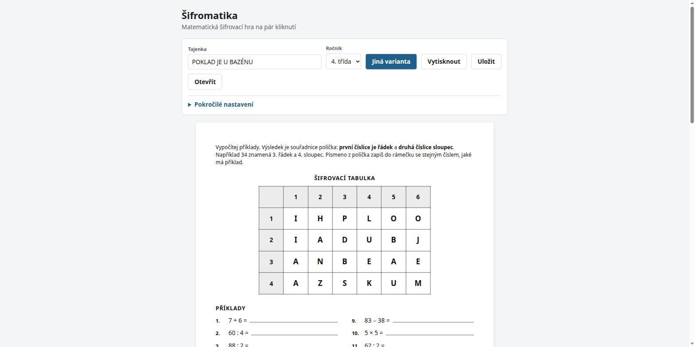

# Šifromatika

**Matematická šifrovací hra pro učitele základních škol.** Napíšeš tajenku, vybereš ročník
a během vteřiny máš hotový pracovní list, řešení i tisk na A4.

Běží celá v prohlížeči. Bez serveru, bez účtu, bez registrace — nic se nikam neodesílá.



---

## Jak to funguje

Učitel zadá tajenku, například `POKLAD JE U BAZÉNU`. Aplikace k ní vytvoří:

- **šifrovací tabulku** se záhlavím řádků a sloupců,
- **matematické příklady** — výsledek každého z nich je souřadnice políčka
  (`34` znamená 3. řádek, 4. sloupec),
- **pracovní list** pro žáky,
- **řešení** pro učitele na samostatné stránce,
- **tisk** na A4 přímo z prohlížeče.

Žák spočítá příklad, najde políčko podle souřadnice, opíše písmeno — a po patnácti příkladech
mu vyjde tajenka. Mimochodem si přitom osahá soustavu souřadnic, kterou se bude učit později.

Vedle šifry umí Šifromatika **list číselných řad**, **pexeso**, **domino** a **bingo**.
Pexeso jsou kartičky k vystřižení, na jedné příklad, na druhé jeho výsledek. Domino jsou
kameny o dvou půlkách — vlevo výsledek, vpravo zadání — a skládají se za sebe do kruhu,
takže si dítě samo zkontroluje, že to má dobře: skončí tam, kde začalo. Bingo hraje celá
třída najednou: učitel čte příklady, dítě škrtá výsledky na své kartě a každá karta je
jiná. Kartičky, kameny i karty se dotýkají, takže se stříhají pár rovnými řezy přes celý
list, a na každé stránce je kontrolní úsečka 100 mm — tiskárna, která zmenšuje, se tím
prozradí dřív, než učitel sáhne po nůžkách.

## Na čem si dává práci

Šifrovačku jde vygenerovat i špatně. Tyhle věci proto řeší Šifromatika záměrně:

- **Klamná písmena.** Kdyby tabulka obsahovala jen písmena z tajenky, žák ji uhodne bez
  počítání. Zbytek tabulky se proto plní podle četnosti písmen v češtině, aby vypadala
  jako český text.
- **Opakovaná písmena mají různé souřadnice.** Když je v tajence třikrát „A", ukazují na tři
  různá políčka. Když se to nevejde, aplikace to řekne — nedegraduje potichu.
- **Stejný výsledek, různé příklady.** Číslo 24 se na listu objeví jako `18 + 6`, `30 − 6`,
  `6 × 4` i `48 : 2`. Tentýž výraz se na jednom listu neopakuje.
- **Tabulka je vždy 9×9.** Nehledá se nejmenší, která tajenku uveze. Z mřížky 4×6 by žák
  přečetl, že žádný výsledek nepřesáhne 46 — a chybný výpočet by poznal bez ověřování.
  Devítka na devítku vypadá stejně pro tajenku o čtyřech písmenech i o čtyřiceti.
- **Zaškrtnuté operace se na list opravdu dostanou.** Čtvrťák počítá do sta, takže hodnotu
  71 vyrobí sčítáním, ale malou násobilkou nikdy. Písmena se proto po tabulce nerozhazují
  rovnoměrně, ale tak, aby zvolený poměr operací vyšel.
- **Přiměřená obtížnost.** Obor čísel se odvozuje z ročníku. Nemůže tak vzniknout list,
  který po třeťákovi chce příklady mimo jeho obor.
- **Každý list projde kontrolou.** Před zobrazením se nezávisle přepočítají všechny příklady
  a list se zpětně rozluští. Když cokoli nesedí, list se nevytiskne. Učitel ho rozdává
  pětadvaceti dětem — tichá chyba tu stojí celou hodinu.

## Uložení a sdílení

Hotovou aktivitu lze uložit jako soubor `.sifra` a později otevřít, upravit a znovu vytisknout.

Soubor má kolem půl kilobajtu, protože obsahuje jen zadání a náhodné semínko — tabulka
i příklady se dopočítají. Součástí je kontrolní součet, takže když by budoucí verze aplikace
vytvořila z téhož souboru jiný list, dozvíš se to, místo aby ti nesedělo dřív vytištěné řešení.

## Spuštění

Potřebuješ [Node.js](https://nodejs.org/) 20 nebo novější.

```bash
npm install
npm run dev      # vývojový server na http://localhost:5173
```

Produkční build:

```bash
npm run build    # výsledek v dist/
npm run preview
```

### Skripty

| Příkaz | Co dělá |
|---|---|
| `npm run dev` | vývojový server |
| `npm run build` | produkční build |
| `npm test` | testy (Vitest) |
| `npm run test:watch` | testy v režimu watch |
| `npm run typecheck` | kontrola typů |
| `npm run lint` | lint |
| `npm run arch` | kontrola hranic mezi vrstvami |
| `npm run check` | všechno výše najednou |

## Architektura

Šifromatika není jedna hra, ale základ pro víc matematických aktivit. Proto stojí na jednom
rozhodnutí: **šifra a matematika jsou oddělené vrstvy, které o sobě navzájem nevědí.**

```
tajenka ──► [ ŠIFRA ] ──► seznam cílových hodnot ──► [ ÚLOHY ] ──► pracovní list
             tabulka,          [24, 7, 56, …]         18+6, 63−56, …
             souřadnice
```

Šifra řekne jen „potřebuji úlohy s výsledky 24, 7, 56". Generátor úloh odpoví „umím vyrobit
24 ve 4. ročníku". Díky tomu půjde přidat matematické bingo nebo domino bez sáhnutí do
matematiky — a přidat slovní úlohy bez sáhnutí do šifer.

```
src/
├── core/         čisté TS: rng · text · model · constraints · verify · checksum
├── tasks/        generátory úloh (aritmetika, řady, desetinná čísla, procenta)
├── ciphers/      šifrovací strategie (grid-coord, grid-linear)
├── activities/   moduly = kompozice úloh a šifer
├── render/       vykreslení na obrazovku a na tisk
├── features/     ovládací prvky
└── storage/      formát .sifra
```

Hranice mezi vrstvami nejsou jen doporučení v dokumentaci — vynucuje je `npm run arch`
jako chybu. `core/` a `tasks/` nesmí importovat React ani nic z DOM, aby zůstaly
znovupoužitelné.

Podrobněji:

- [Vize](VISION.md) — proč projekt vzniká a podle čeho se rozhoduje, co do něj patří
- [Návrh architektury](docs/sifromatika-navrh-architektury.md) — proč to stojí takhle,
  včetně míst, kde se návrh rozešel s původním zadáním
- [Rozsah verze 0.1](docs/rozsah-0.1.md) — co je hotové, co vědomě není a proč

## Stav projektu

**Verze 0.1.** Použitelná: vytvoří list, ověří ho a vytiskne.

Umí pět aktivit — šifru se souřadnicovou i lineární tabulkou, list číselných řad, pexeso,
domino a bingo — pro **3. až 8. ročník**. Vedle čtyř základních operací zvládne pořadí operací a závorky,
celá čísla, mocniny a odmocniny, desetinná čísla (`3,5 · 4`) a procenta (`25 % z 80`).
K tomu klamná písmena, tisk, soubory `.sifra` a diplom ke stažení.

Devátý ročník se schválně nenabízí: chybí mu rovnice a lomené výrazy, a dát deváťákovi
osmáckou matematiku pod nadpisem „9. třída" je horší než ročník nenabídnout.

Výsledek každé úlohy je vždy kladné celé číslo — je to kód políčka v tabulce. Desetinná
čísla a procenta proto patří do zadání, ne do výsledku.

Zatím neumí slovní úlohy, geometrii, převody jednotek, zlomky, PDF export bez tiskového
dialogu, offline režim ani sdílení odkazem. Plán je v [roadmapě](docs/sifromatika-navrh-architektury.md#7-roadmapa-01--10).

## Testování

460 testů. Kromě obvyklých jednotkových testů dva druhy, na kterých projekt stojí:

- **Property testy** — 10 000 náhodných konfigurací musí dát nula nepoužitelných listů.
  Ruční testy tenhle prostor kombinací nepokryjí.
- **Golden testy** — daný seed musí dát bit shodný výstup. Když snapshot selže, znamená to,
  že se rozešly všechny dosud uložené soubory `.sifra`. **Neaktualizuj ho příkazem
  `vitest -u`** — buď je změna nechtěná a patří vrátit, nebo je záměrná a patří k ní
  inkrement `GENERATOR_VERSION`.

## Přispívání

Nejužitečnější je zpětná vazba od učitelů: co na listu chybí, co děti mate, co bys tiskl jinak.

Když chceš přidat typ úloh, stačí jeden adresář v `src/tasks/` a řádek v registru.
Nová aktivita je adresář v `src/activities/` a řádek v `activities/registry.ts` — chybějící
modul k `ActivityId` neprojde překladem. Nic jiného se měnit nemá. Před odesláním prosím spusť `npm run check`.

## Licence

[MIT](LICENSE). Kód i vygenerované listy smíš používat ve výuce i mimo ni, upravovat
a šířit dál.
